# ［教員向け］Webexの使い方

## 全体の流れ

1. [STEP 1. 1度だけ行う準備](#prepare_once)
    1. [STEP 1-1. Webexアカウントの作成](#make_new_account)
    1. [STEP 1-2. アプリのインストール](#app_install)

1. [STEP 2. 講義の前に行う準備](#prepare_class)
    1. STEP 2-1. 資料の作成など（本稿では説明しません）
    1. [STEP 2-2. 講義のスケジュール](#schedule_class)
    1. [STEP 2-3. 講義URL等の取得](#obtain_class_url)
    1. STEP 2-4. BEEF等への講義URLの掲載による講義の周知（本稿では説明しません）

1. [STEP 3. 講義の実施](#do_class)
    1. [STEP 3-1. 講義の開始](#start_class)
    1. [STEP 3-2. 講義を実施する前に](#before_starting_class)
    1. [STEP 3-3. 講義中にできること](#during_class)

<h2 id="prepare_once">STEP 1. 1度だけ行えば良い準備</h2>

<h3 id="make_new_account">STEP 1-1. アカウントの作成</h3>

ビデオ会議をホストするには，まず，Cisco Webexのアカウントを作成します。

1. [Cisco Webexのサイト](https://www.webex.com/ja/) にアクセスし，無料で登録のボタンをクリック（図中，赤で囲った部分）
   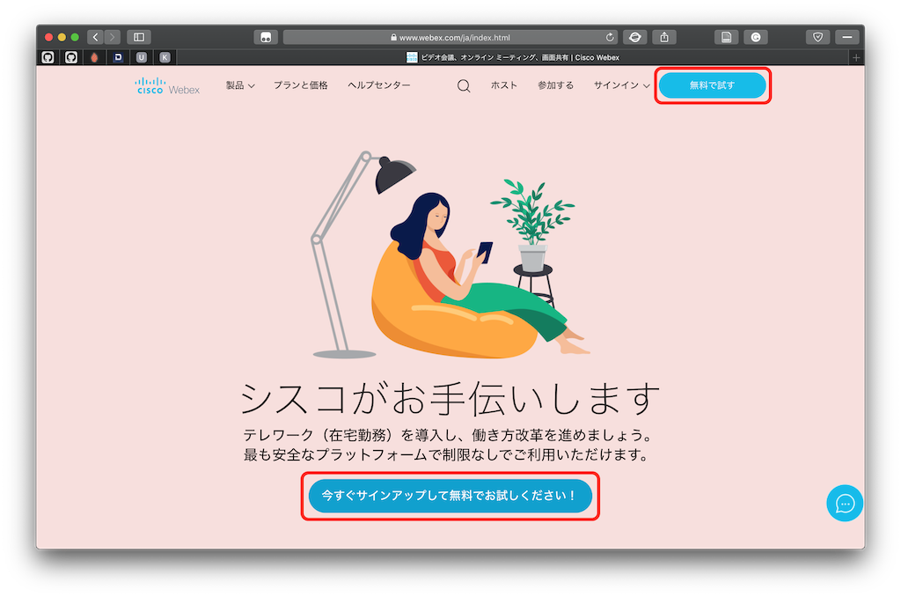

1. メールアドレスを入力して「サインアップ」をクリック
   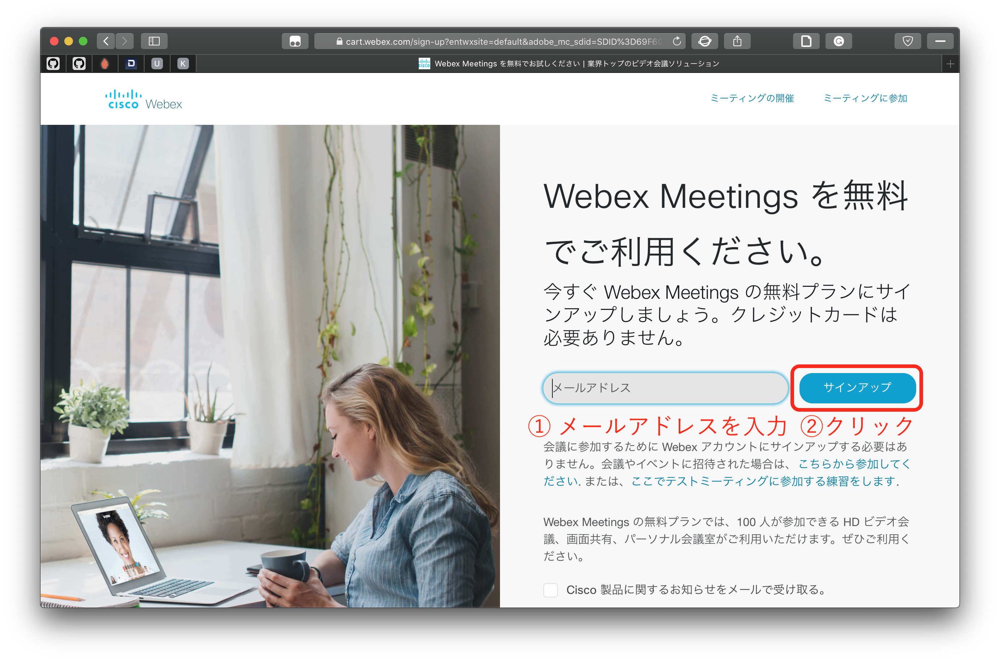

1. 国を選択，氏名を入力して「次へ」（※国は日本でいいと思います）
   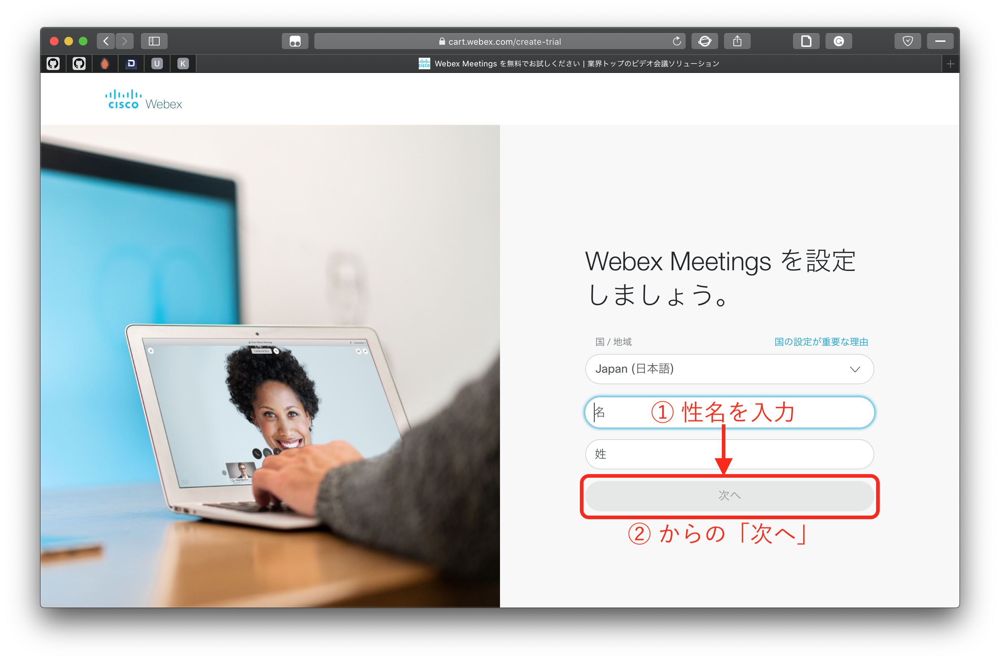

1. 上記までの手順を終了すると，登録したメールアドレスにメールが届く。
   メール中の「パスワードを作成」というリンクをクリックしてWebサイトにアクセスします。
    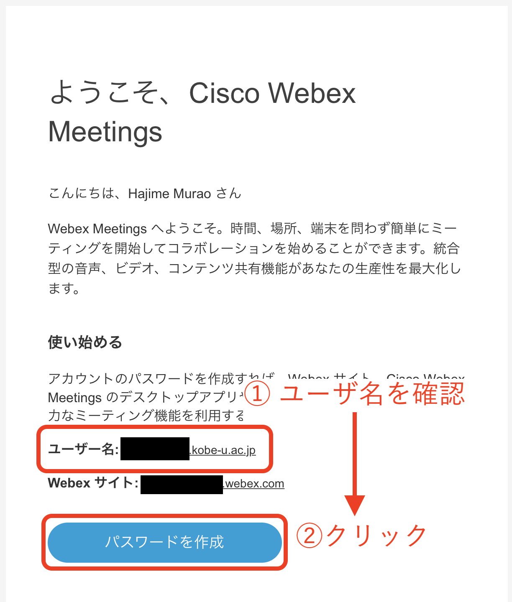

1. Webサイトでパスワードを入力
   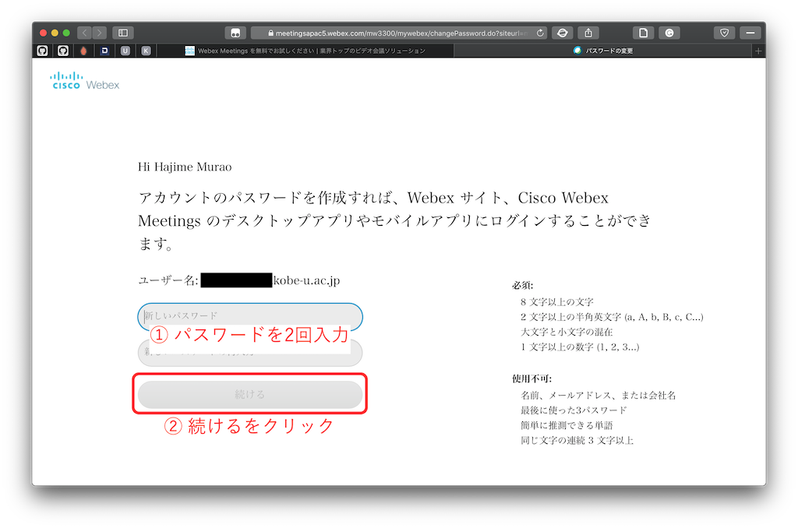

   登録が終了すると，そのまま以下のようなWebex Meetingsのホーム画面に移行します。
   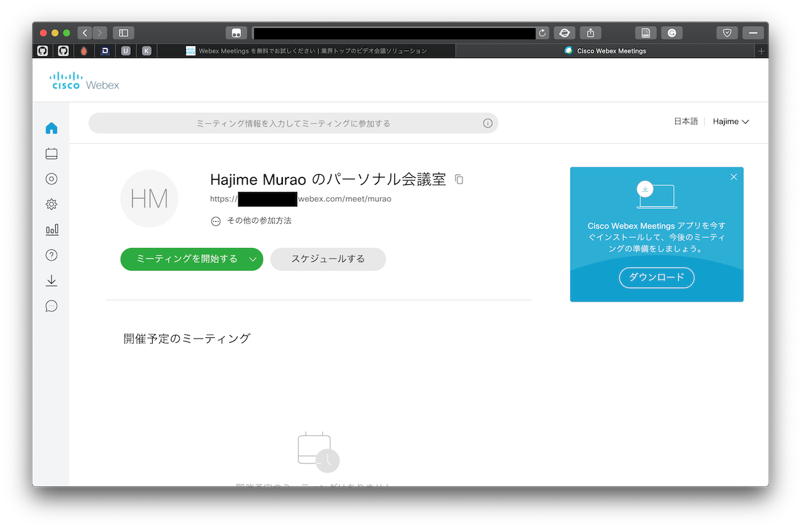

1. タイムゾーンを設定します。初期設定ではなぜか「(UTC+8) クアラルンプール，シンガポール」になっていることが多いので，これを日本に変更します。
    1. Webex Meetingsのホーム画面から左の「基本設定」を開き，さらに「全般」を開きます。
    1. タイムゾーンを「(UTC+09:00) 大阪，札幌，東京」に変更し，最後に「保存」します。
       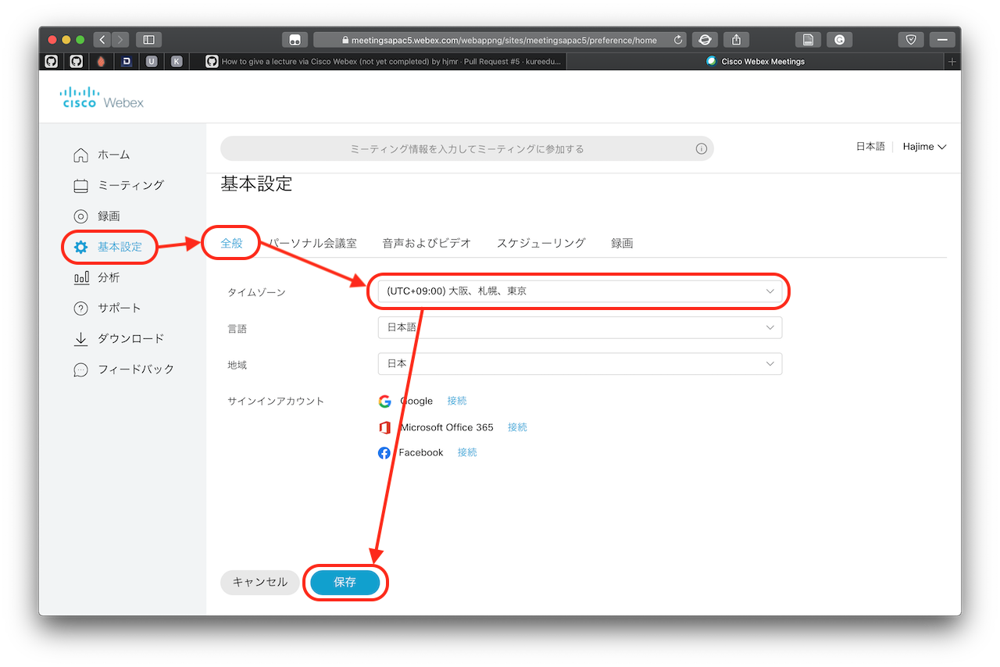

<h3 id="app_install">STEP 1-2.アプリのインストール</h3>

ビデオ会議用のアプリケーションである「Cisco Webex Meetings」をインストールします。

1. インストーラのダウンロード
    - Webex Meetingsの画面上の右側に「Cisco Webex Meetingsアプリを今すぐインストール」の画面が出ている場合はその下の「ダウンロード」をクリック。
    - そうでない場合は[Cisco Webexダウンロード](https://www.webex.com/ja/downloads.html)にアクセスして「Cisco Webex Meetings」をダウンロード
    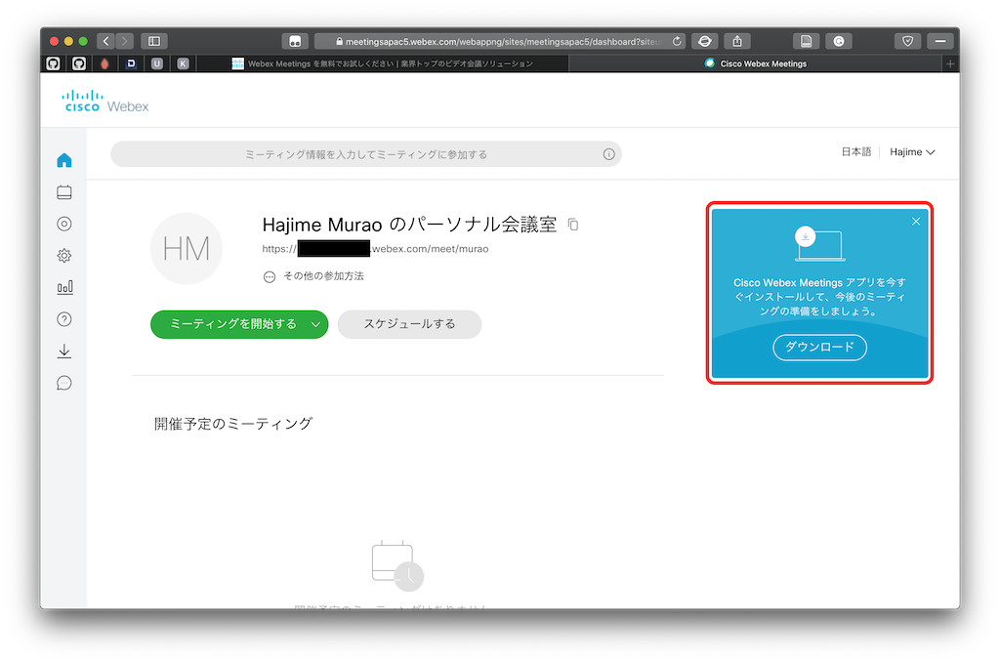
1. 手元のPC上でインストーラを開いて，指示に従ってインストール。

<h2 id="prepare_class">STEP 2. 講義の前に行う準備</h2>

### STEP 2-1. 講義資料の作成

本稿では説明しません。

<h3 id="schedule_class">STEP 2-2. 講義のスケジュール</h3>

Webexの講義のスケジュールはWebサイト経由で行います。

1. まず，Webex Meetingsのサイトにログインします。ログイン画面へのアクセスは以下の2通りです。
    - 直接，[Webex Meetingsのログイン画面](https://www.webex.co.jp/go/jp_host-meeting)にアクセスします。
    - [Webexのサイト](https://www.webex.com)にアクセス。画面上の「ホスト」をクリックします。
    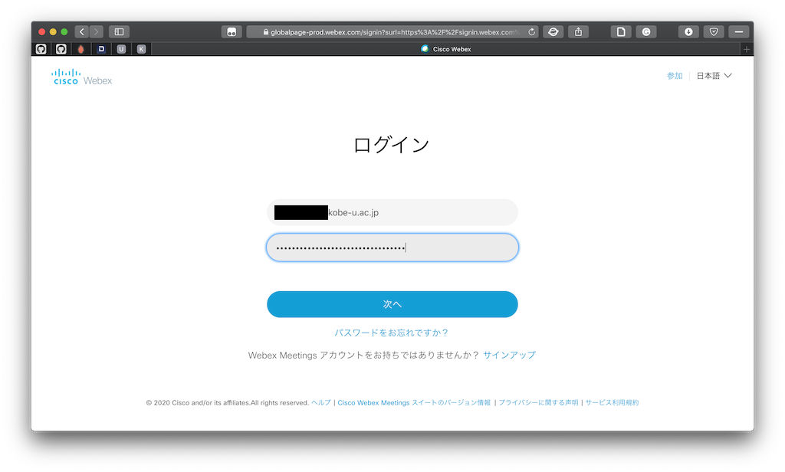

1. Webex Meetingsのホーム画面から「スケジュールする」をクリックします。
   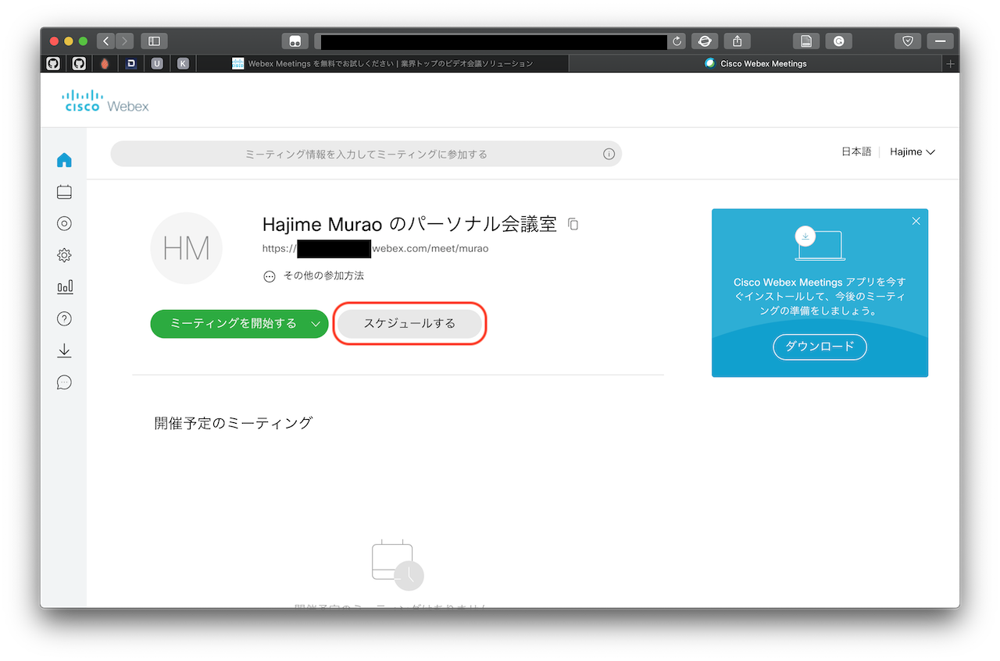

1. ミーティングのスケジュール画面で以下の情報を入力し，スケジュールします。なお，詳細設定を含め，全ての設定はスケジュールを作成後に変更可能です。
    - ミーティングの議題：講義名で良いと思います。
    - ミーティングバスワード：ランダムなものが生成されます。自分で設定することも出来ますが，セキュリティ上あまりお薦めしません。
    - 日時：ミーティングの開始時間と継続時間を設定します。
        - 授業時間は105分（1時間45分）ですが，
        前後に5分程度余裕を持たせて2時間ぐらいでどうでしょう。
        - 実際にはこの開始時間・終了時間と実際にミーティングが実施可能かどうかは関係なさそうです。
        試したところ，時間に関係なくミーティングを開始できました。
    - タイムゾーン：「大阪，札幌，東京（UTC+9）」になっていることを確認します。
    - 繰り返し：これを使うと毎週同じ時間のミーティングが設定できます。毎週の講義は繰り返しで予定すると良いかもしれません。
    - 出席者：空で結構です。
    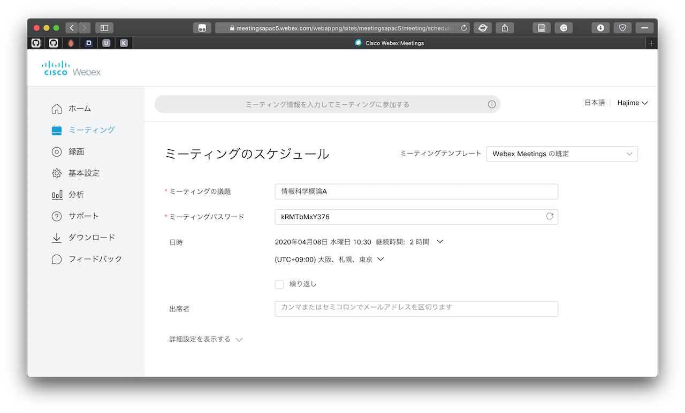

1. 必要に応じて「詳細設定」を行います。詳細設定で特に注意したいのは以下の点です。
    - 主催者より先に参加：出席者（学生）は主催者（教員）がミーティング（授業）を開始するよりも，設定された時間だけ早めに接続して待つことができます（デフォルトでは5分前に接続できる）
    - 出席者の権限：出席者同士のプライベートなチャットを許可するかどうかは考慮の必要があるかと思います。

1. ミーティングがスケジュールされると，Webex Meetingsのホーム画面下に「開催予定のミーティング」として（画像上），また，Cisco Webex Meetingsのアプリケーション起動画面の「今後のミーティング」（画像下）に表示されます。
   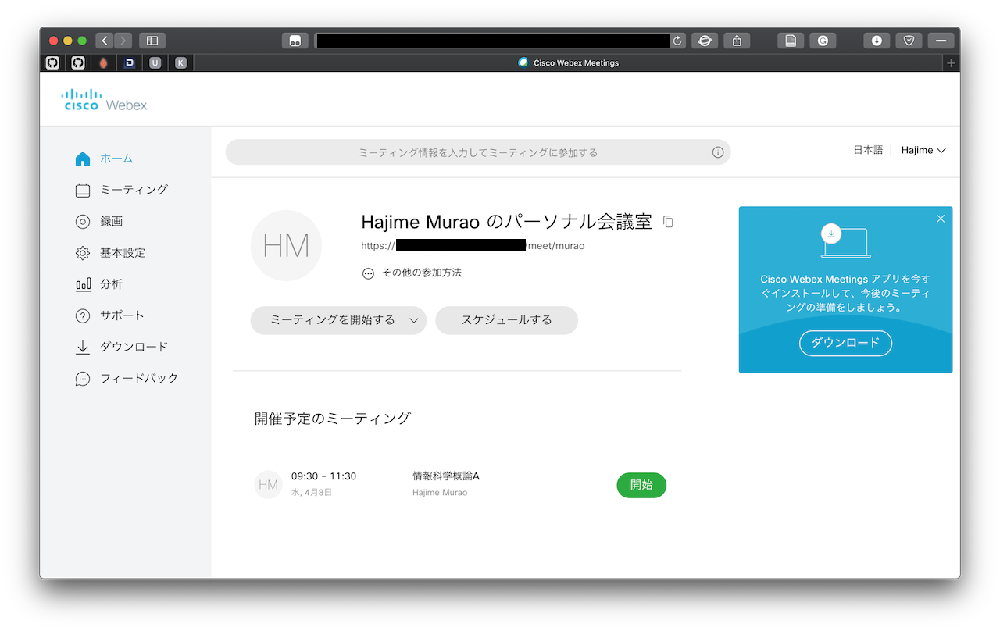
   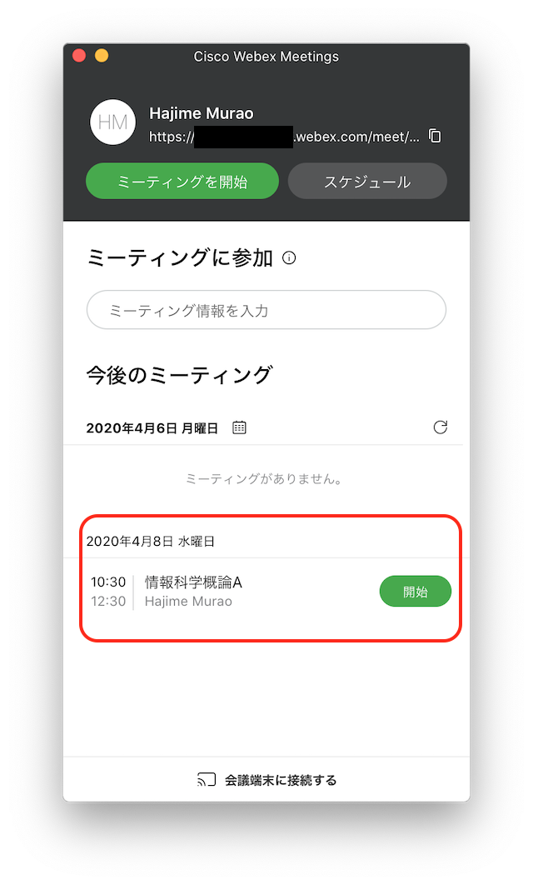

<h3 id="obtain_class_url">STEP 2-3. 講義URLの取得</h3>

BEEF等に掲示して周知するための講義URL等の情報はスケジュール画面から確認することができます。
スケジュールは Webex Meetings のホーム画面またはスケジュール画面から確認することができます。

1. Webex Meetingsのホーム画面の画面下，またはスケジュール画面に，開催予定のミーティング一覧があるので，講義名をクリックします。
   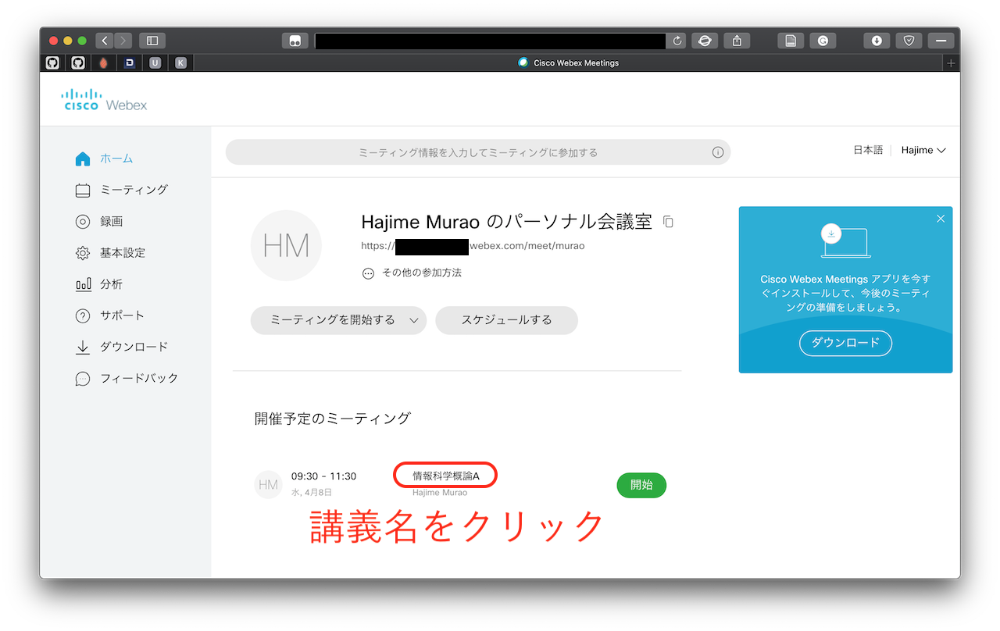

1. するとスケジュールの詳細を確認することができます。
    - この画面のミーティング情報の「ミーティングリンク」が講義URLです。
    - また，この画面でスケジュールの詳細を編集して変更することもできます。
    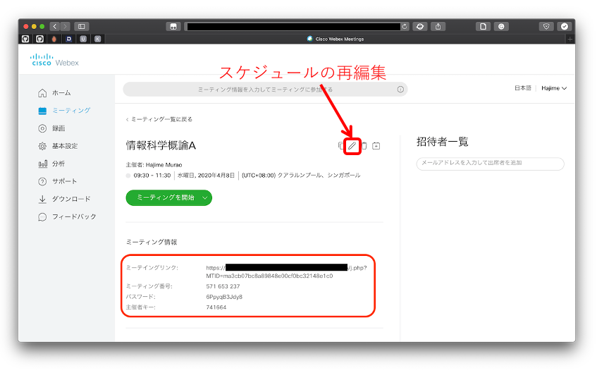

### STEP 2-4. BEEF等への講義URLの掲載による講義の周知

本稿では説明しません。

<h2 id="do_class">STEP 3. 講義の実施</h2>

<h3 id="start_class">STEP 3-1. 講義の開始</h3>

Webex Meetingsのホーム画面（Webサイト）もしくはアプリを起動してスケジュールされた講義を「開始」すると講義を開始することができます。
1. スケジュールされた講義の開始
   - Webex Meetingsのホーム画面でスケジュールの横の「開始」をクリックすると，ブラウザの画面が開き，さらにWebex Meetingsアプリが起動し，講義を開始する画面になります。
    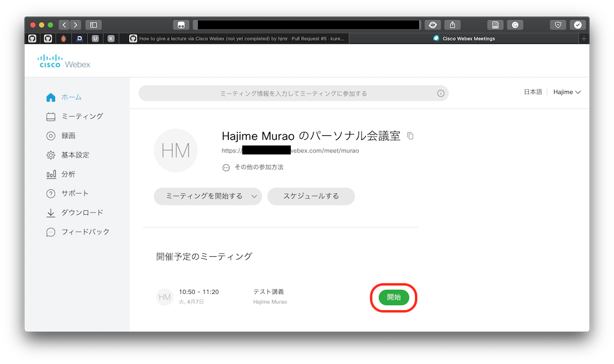
    - Webex Meetingsのアプリを起動，画面下のスケジュールから「開始」をクリックすると，講義を開始する画面になります。
    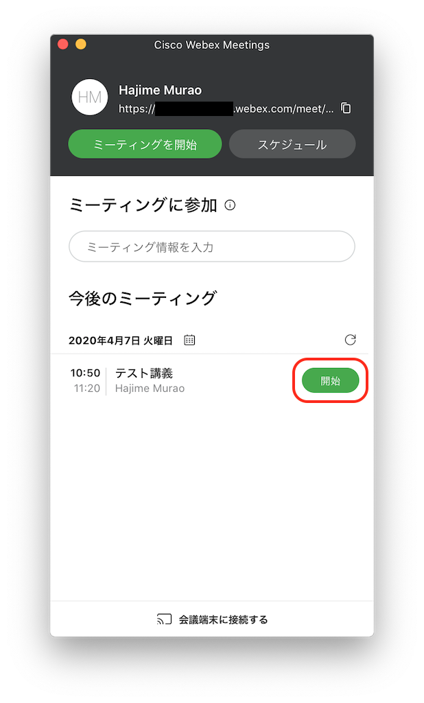

1. 続いて講義のスタート画面が表示されます。
   この時点では講義は開始していません。この画面で予めいくつかの設定をすることが可能です。
   設定を確認したら「Start Meeting」ボタンをクリックして講義を開始します。
    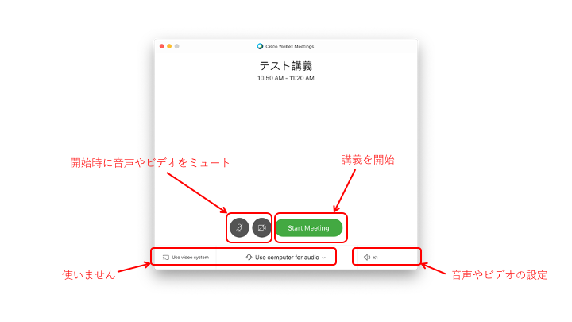

<h3 id="before_starting_class">STEP 3-2. 講義を実施する前に</h3>

講義を開始すると以下のような画面が現れます。
これは講義中と同じ画面ですが，いくつか開始前にはできない設定ができますので，学生が参加する前にいくつか設定をしておきます。

- 「参加者」メニュー（英語の場合は Participants ）：
  参加者のミュートや共有の許可設定を変更することができます。
  特にセキュリティ上の観点から，「誰でも共有可」（Anyone can share）のチェックは外しておいた方が良いと思います。
  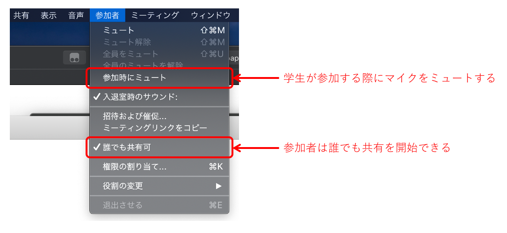

<h3 id="during_class">STEP 3-3. 講義中にできること</h3>

講義中には以下のような画面が表示されます。

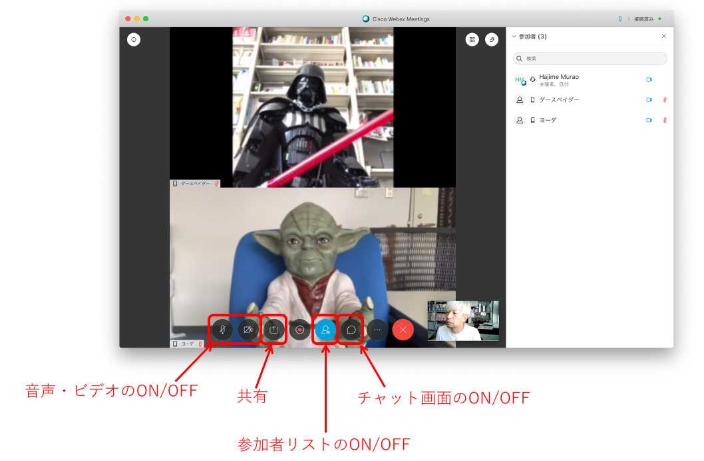

この画面からは以下のような作業が可能です。
- ミーティングのロック（「ミーティング」メニュー等から）
    - これ以上のミーティングへの参加を禁止します。
- 権限の譲渡（「参加者」メニューまたは参加者リストで参加者を右クリック）
    - 主催者またはプレゼンターの権限を渡します。
    - プレゼンターの権限を持つ参加者は「誰でも共有可」がオフでも共有が可能です。
- 参加者の強制退出など（参加者リストで参加者を右クリック）
    - 「退出させる」：参加者をミーティングから強制退出させます
    - 「ロビーに移動」：参加者をロビーに移動します。
    ロビーに移動した参加者は主催者が許可するまでミーティングに参加できません。
