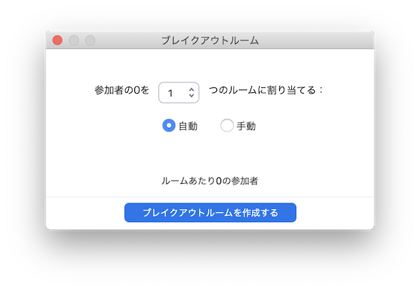

## ブレークアウトを有効にする

[ZOOM公式サイトのマイページ](https://zoom.us/profile/setting{:target="_blank"}) で設定を変更します．
  1. 個人の設定で
  1. ミーティングの設定項目の中にある
  1. ミーティングにて（詳細）グループの最初にある「ブレークアウトルーム」を有効にするスライダーをON

## ミーティングでブレークアウトを設定

ブレークアウトが有効になると，メニューに「ブレークアウト」が追加されます．

メニューの「ブレークアウト」からブレークアウトルームの設定をします．（ミーティングルームを何個かのブレークアウトルームに分割します）

# グループワークに使えます
