## ブレイクアウトを有効にする

[ZOOM公式サイトのマイページ](https://zoom.us/profile/setting{:target=_blank}) で設定を変更します．
  1. 個人の設定で
  1. ミーティングの設定項目の中にある
  1. ミーティングにて（詳細）グループの最初にある「ブレイクアウトルーム」を有効にするスライダーをON
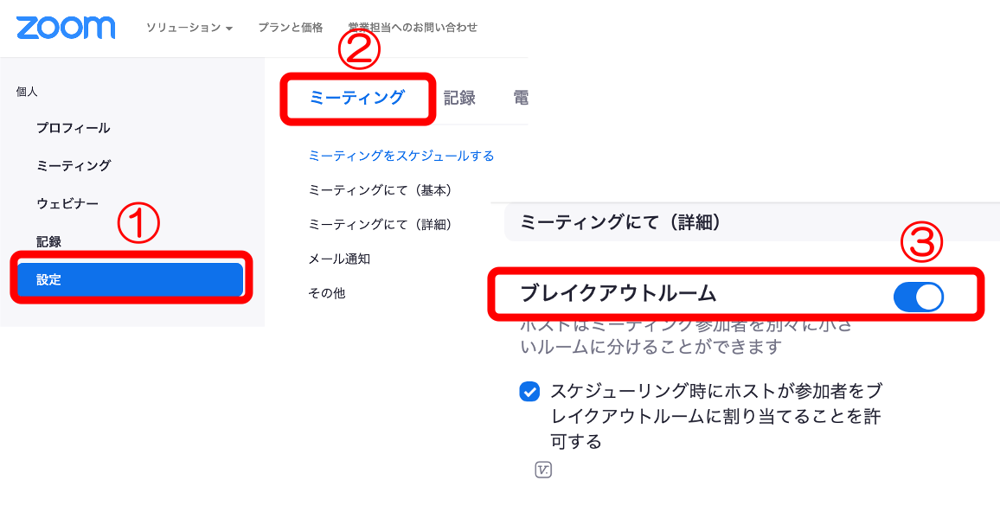

## ミーティングでブレイクアウトを設定

ブレイクアウトが有効になると，メニューに「ブレイクアウト」が追加されます．

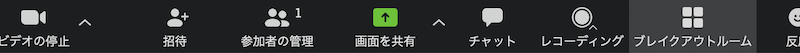

メニューの「ブレイクアウト」からブレイクアウトルームの設定をします．
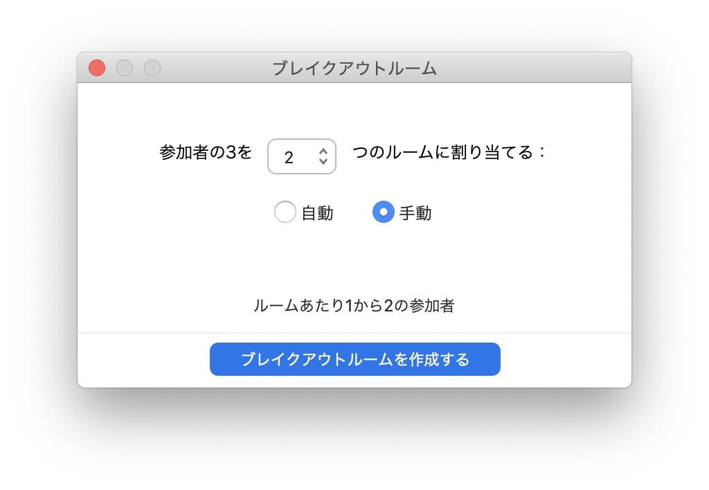

ミーティングルームを何個かのブレイクアウトルームに分割します

## 学生をグループに分ける

ブレイクアウトルームダイアログで，学生グループとブレイクアウトルームを対応づけます

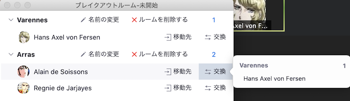

学生を入れ替えています．

学生が参加するブレイクアウトルームを変更しています．

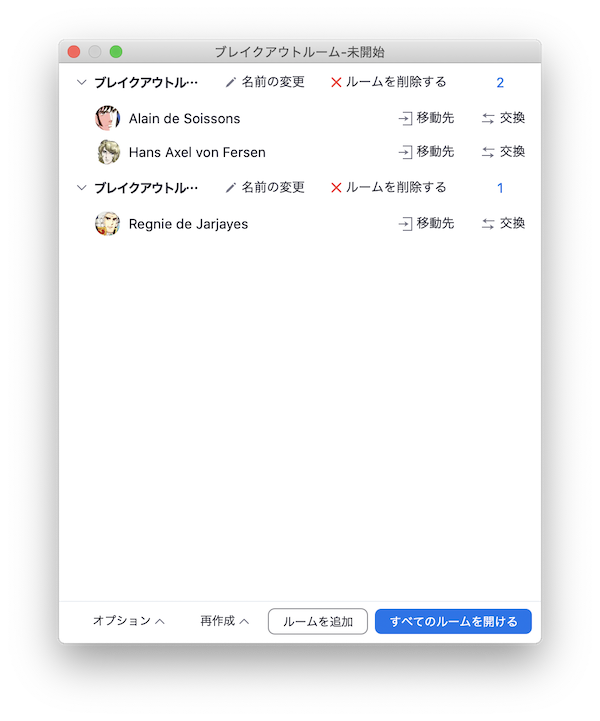

「すべてのルームを開ける」でブレイクアウトルームを開始します．

## ブレイクアウトルームに参加

ブレイクアウトルームに割り当てられた学生さんは下のようなメッセージを受け取ります．

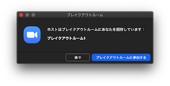

参加するをクリックすると，

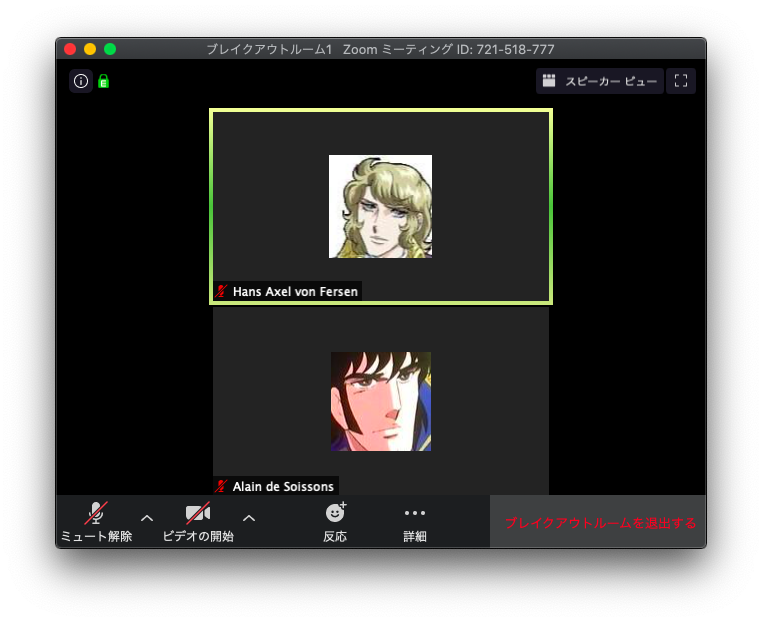

割り当てられたグループのブレイクアウト・ミーティグルームに参加します．グループワークが開始されるはずです．

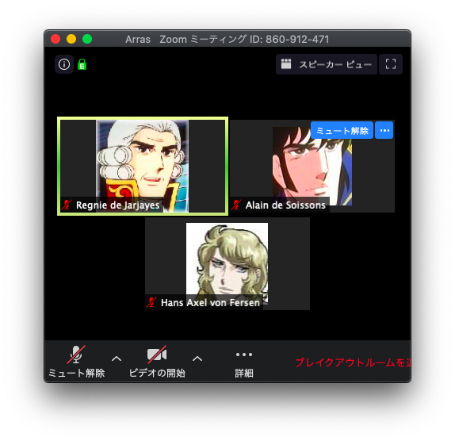

教員はブレイクアウトルームダイアログの各ブレイクアウトルームの右にある参加ボタンを押して

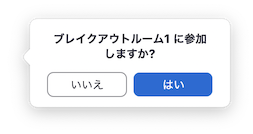

参加しますか？「はい」で参加します．

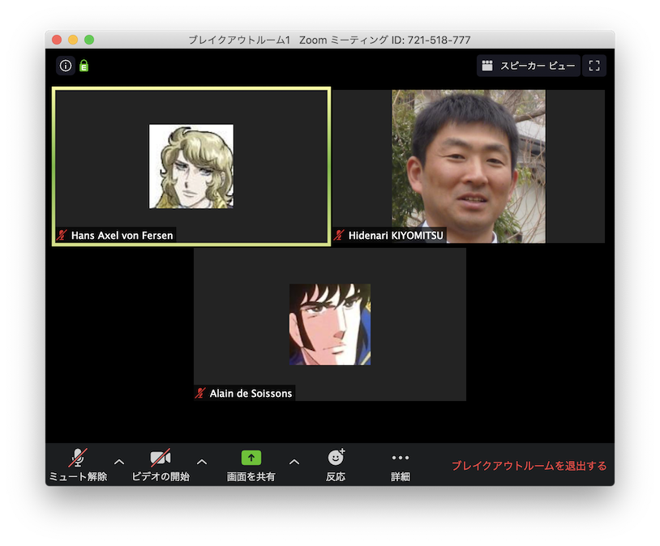

他のブレイクアウトルームに参加する時は，既に参加しているブレイクアウトルームを退出します．

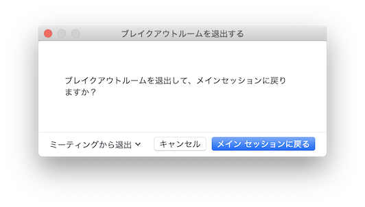

メインセッションに戻ります．
