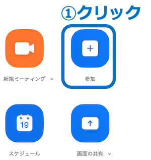
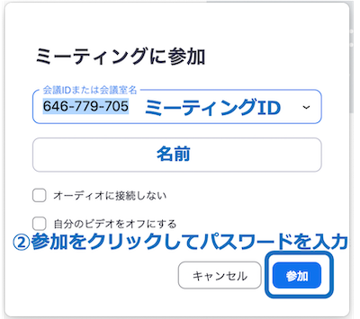

# ミーティングルームに入る

このページはミーティングルームへの入り方を説明しています．

- [URLを用いる方法](#URLを用いる方法)

- [ミーティングIDを用いる方法](#ミーティングIDを用いる方法)

の二通りの方法があります．それぞれ説明します．

## URLを用いる方法

1. BEEF，メールなどで届くリンク
（`https://zoom.us/j/xxxxxxxxxx?pwd=xxxxxxxx` xは英数字）
をクリック，または，コピーしてWebブラウザーのアドレスバーに貼り付けます．

1. Web ブラウザーが「Zoom Meetings を開きますか？」というダイアログを出すので，「Zoom Meetings を開く」をクリックします（Zoom がインストールされてない場合は，ダウンロードして Zoom をインストールします）

1. 「コンピューターでオーディオに参加」を選択します

## ミーティングIDを用いる方法

Zoom を起動します

1. 「ミーティングに参加」を押します

2. ミーティングIDと名前を入力して「参加」をクリックします

3. パスワードを入力します．

size
