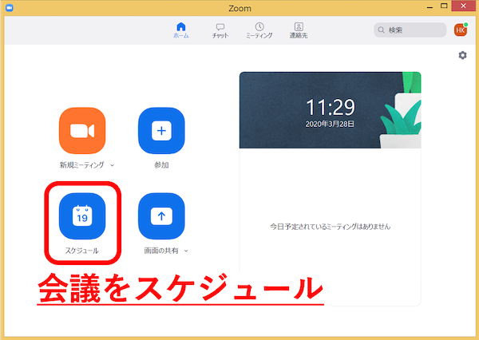
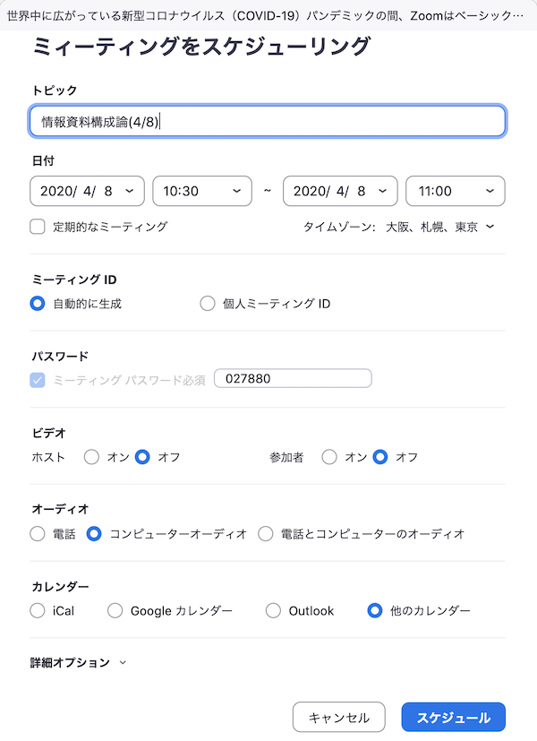
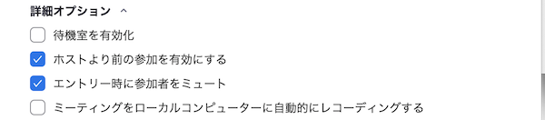
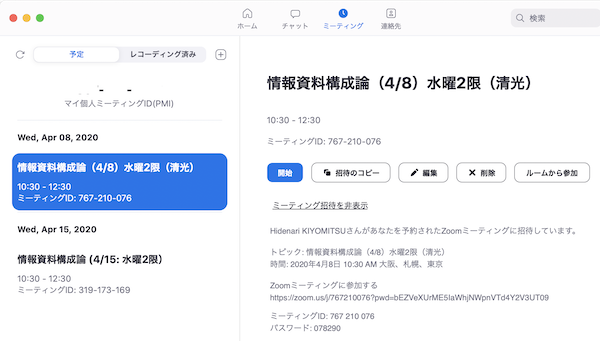

# ミーティングをスケジュール

ミーティングをスケジュールする方法を説明しています．

  * [基本項目設定](#基本設定項目)
  * [オプション項目設定](#詳細オプション)
  * [スケジュールの確認](#スケジュールの確認)

  

ホーム画面のスケジュールをクリックして「ミーティングをスケジュール」ダイアログを出します．

各項目をご希望通りに設定して「スケジュール」ボタンをクリックします．

## 基本設定項目

1. トピック（スケジュールしたミーティングに名前をつけます）

1. 日付（ミーティングの開始時刻と終了時刻を設定します）

1. ミーティングID（自動的に生成がいいと思います）

1. パスワード（自動的に生成されます：変えてもいいです）

1. ビデオ（まずは，ホストも参加者も「オフ」から始めて，必要な時にミーティングの中で「オン」しましょう）

1. オーディオ（コンピューターオーディオでいいと思います）

1. カレンダー（わたしは「その他のカレンダー」にしています）

## 詳細オプション

1. 待機室を有効化

1. ホストより前の参加を有効にする

1. エントリー時に参加者をミュートする

1. ミーティングをローカルコンピュータに自動的にレコーディング

## スケジュールの確認

ZOOM画面のミーティングでスケジュールされたミーティングを確認します．

